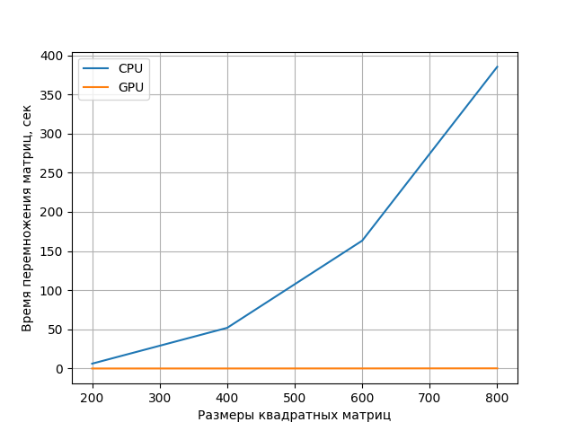

LAB1 (MatMul)

В данной работе была реализована функция перемножения матриц с использованием CPU и GPU.
Для сравнения производительности CPU и GPU при выполнении алгоритма перемножения матриц была использована временная метрика, которая показывает затраченное время на выполнения операции перемножения.
Для выполнения кода на GPU использовалась библиотека PyTorch.
Результатом выполнения алгоритма является приложенный график. Из графика видно, что при росте размерности матрицы растет и время затраченное на выполнение алгоритма при использовании CPU. Однако при использовании GPU время на выполнения алгоритма почти не изменяется. Следовательно, очевидно, что производительность GPU кратно выше чем CPU. Такую разницу можно объяснить тем, что GPU способен выполнять операции не последовательно, а параллельно, следовательно, из-за это и уменьшаться время выполнения алгоритма. 

