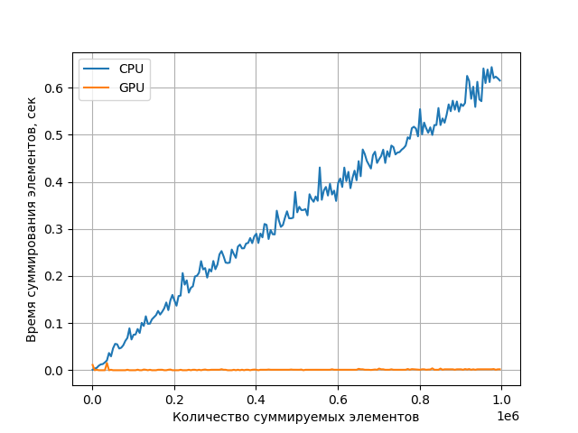

LAB2(Vector Sum)

В данной работе, аналогично, LAB1 результаты вычисления на GPU показали лучший результат.
В данной работе снова использовалась библиотека PyTorch для вычислений на GPU. При выполнении операций задачи VectorSum GPU использует большое количество ядер и выполняет параллельные вычисления и задача решается быстрее чем на CPU.  
