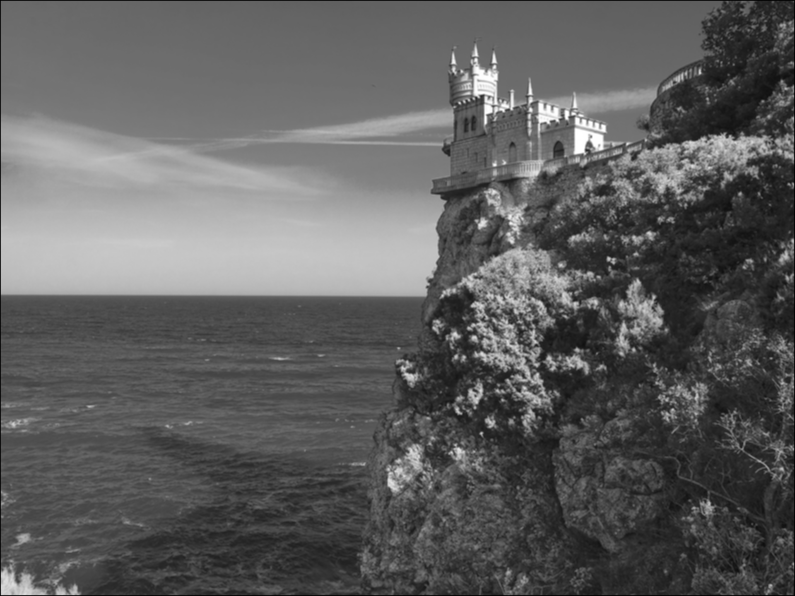
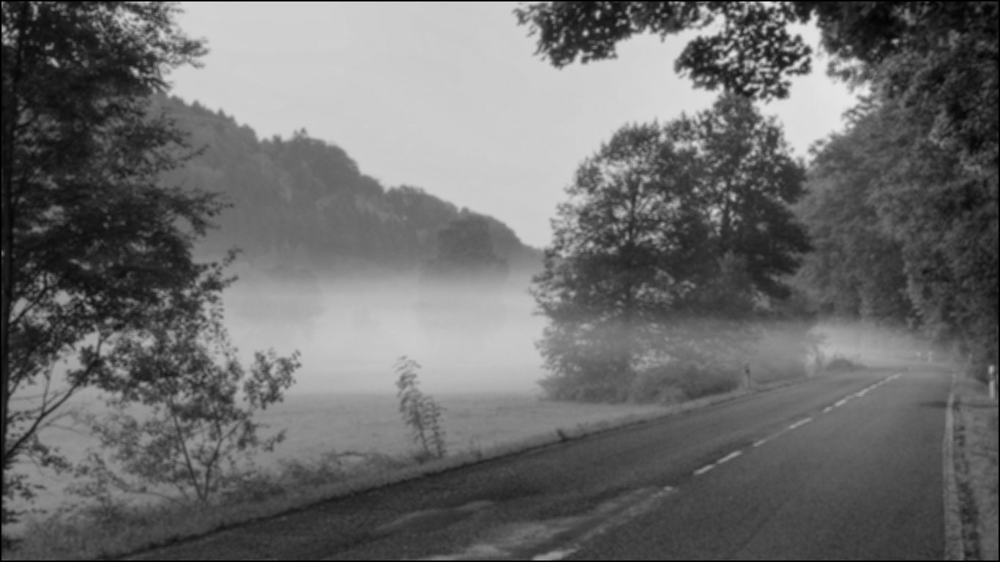

Tower original

Tower CPU:  579.9344708919525

Tower GPU:  0.49516797065734863 

Priroda original

Priroda CPU:  438.9732880592346

Priroda GPU:  0.4137566089630127

Road original

Road CPU:  222.42010879516602

Road GPU:  0.2813892364501953

Так как в данном примере были использованы примеры больших изображений, то во всех примерах обработка на GPU занимала на порядок меньше времени. Однако если бы изображение было бы не большое, то результат мог бы быть обратным.
Данный факт обусловлен тем, что процессор имеет меньше количество ядер, но более производительных и операции выполняются последовательно. А на GPU много ядер, которые слабее, но используют параллельное вычисление.
